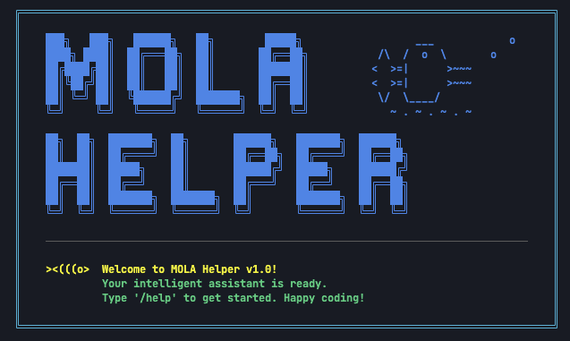

<div align="center">

#  Mola Helper


**Your Intelligent Agent Assistant**

*A powerful, extensible LLM-powered agent framework*

[](https://www.python.org/)
[](LICENSE)

</div>

---

## ✨ Features

- 🔌 **Multi-LLM Support** - Seamlessly works with Ollama, Doubao, SiliconFlow and more
- 📧 **Email Management** - Get, read, and delete emails with simple commands
- 📚 **arXiv Paper Search** - Search academic papers directly from arXiv
- 🛠️ **Extensible Skills** - Add new capabilities through the skill system
- 💾 **Memory System** - Context-aware conversations with persistent memory
- 📦 **JSON-First Design** - Structured, predictable tool calling

## 🚀 Quick Start

### 1. Clone the Repository
```bash
git clone https://github.com/molamola-xtq/MolaHelper.git
cd MolaHelper
```

### 2. Install Dependencies
```bash
pip install -r requirements.txt
```

### 3. Configure Environment
Create a `.env` file in the project root:
```env
# LLM Configuration
PROVIDER=siliconflow
MODEL=
URL=https://api.siliconflow.cn/v1/chat/completions
API_KEY=

# Email Configuration (Optional)
EMAILS=your_email@example.com
KEY=your_email_password # SMTP authorization code
IMAP=imap.example.com
PORT=993
```

### 4. Run Mola Helper
```bash
python chat.py
```

## 📁 Project Structure

```
Agent/
├── agent_config.py    # Configuration management
├── chat.py            # Core chat logic
├── tool_config.py     # Tool registration
├── Memory.py          # Conversation memory
├── email_utils.py     # Email utilities
├── paper.py           # arXiv search
├── caller.py          # Tool caller
├── logo.py            # ASCII art logo
└── skills/            # Extensible skills
    ├── arxiv查询论文列表.md
    ├── 本地时间读取.md
    └── 邮箱助手.md
```

## 🎯 Use Cases

| Command | Action |
|---------|--------|
| "帮我查一下最新的AI论文" | Search arXiv for AI papers |
| "读取最新的邮件" | Read your latest emails |
| "现在几点了？" | Get current local time |

## 🔧 Adding New Skills

1. Create a `.md` file in `skills/` directory
2. Create a corresponding `.info` file with skill description
3. Register the tool in `tool_config.py`

## 🤝 Contributing

Contributions are welcome! Feel free to submit issues and pull requests.

## 👤 Author

**Tianqi Xue**

---

<div align="center">

**⭐ If you find this project helpful, please give it a star! ⭐**

</div>
